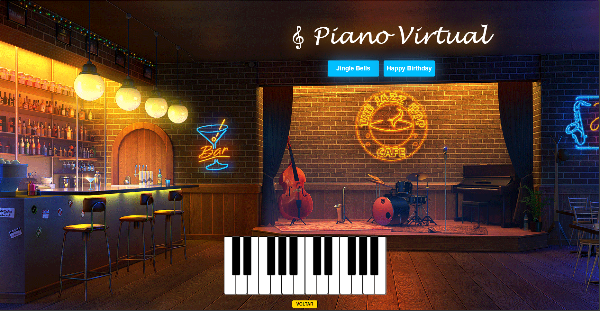
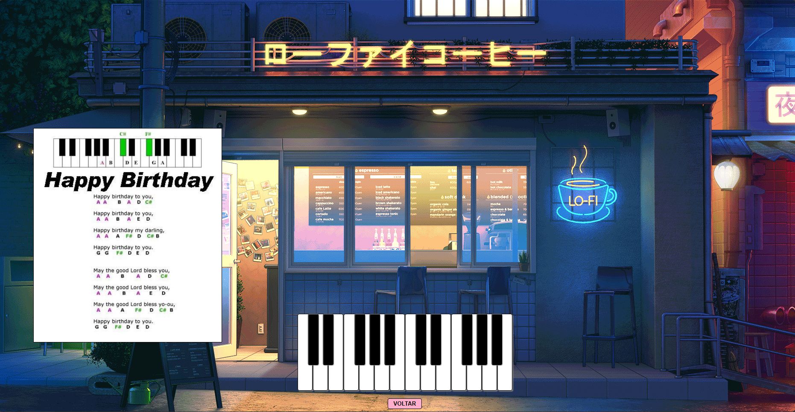

  # 🎹 Piano Virtual
  
  
  
  

 

<h4> Descrição </h4>

 Um <strong>piano virtual</strong> simples, desenvolvido em 2022, que permite tocar notas diretamente do navegador. Não é o mais rápido do mundo, mas foi uma ótima forma de praticar PHP, HTML, CSS e JS. 

 Planejo desenvolver uma nova versão do Piano Virtual, com otimizações em JavaScript e funcionalidades adicionais. 

